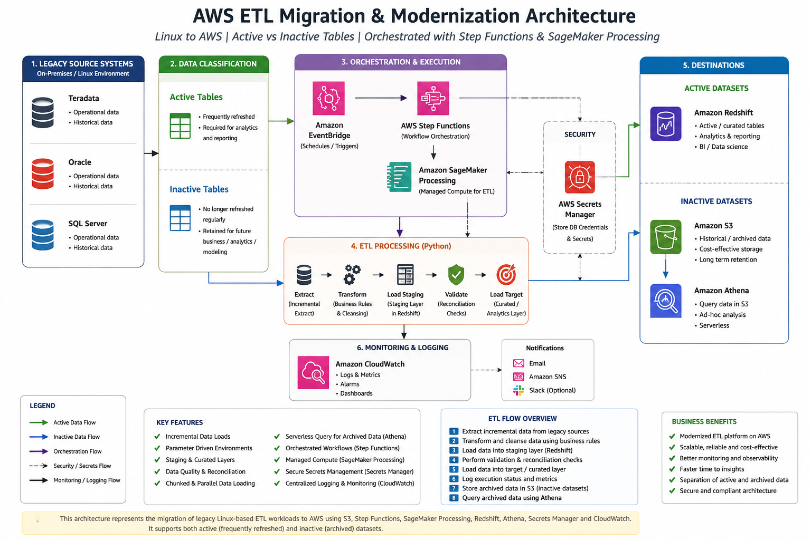

# AWS ETL Migration & Modernization

A sanitized portfolio implementation of a legacy Linux-based ETL modernization pattern.

## Business Problem

Legacy ETL workloads processed data from multiple relational source systems. The modernization approach separated datasets according to business usage:

- **Active datasets:** continue to refresh regularly and support analytics and reporting.
- **Inactive datasets:** no longer require regular refresh but are retained for historical, business, analytical, or future modeling requirements.

Active datasets are represented as Redshift targets. Inactive datasets are archived in S3 and can be queried through Athena.

## Architecture



## Architecture Flow

```text
Legacy Sources
(Teradata / Oracle / SQL Server)
            |
            v
        Python ETL
            |
       +----+----+
       |         |
       v         v
    Active    Inactive
       |         |
       v         v
   Redshift      S3
                   |
                   v
                Athena
```

## Orchestration

```text
EventBridge
     |
     v
Step Functions
     |
     v
SageMaker Processing
     |
     v
Python ETL
     |
     +--> S3
     +--> Secrets Manager
     +--> Redshift
     +--> CloudWatch
```

### Why Step Functions?

SageMaker Processing provides the managed compute used to execute the Python workload. Step Functions provides the workflow orchestration layer: it starts the processing job, waits for completion, handles workflow state, and supports operational control.

This separation keeps compute and orchestration responsibilities distinct.

## ETL Flow

```text
1. Read environment configuration
            ↓
2. Determine incremental processing boundary
            ↓
3. Extract source data
            ↓
4. Transform and cleanse
            ↓
5. Load staging
            ↓
6. Run reconciliation checks
            ↓
7. Load curated target
            ↓
8. Log execution status
```

## AWS Components

| Service | Responsibility |
|---|---|
| EventBridge | Schedule and trigger workflows |
| Step Functions | Orchestrate and monitor processing |
| SageMaker Processing | Managed compute for Python ETL |
| S3 | Script/artifact storage and inactive-data archive |
| Redshift | Active analytics-ready datasets |
| Athena | Query archived S3 data |
| Secrets Manager | Runtime secret management |
| CloudWatch | Logging and operational monitoring |

## Performance Optimization

The portfolio includes a chunked loading pattern that estimates a safe batch size from dataframe memory usage, splits the dataframe into batches, and processes batches with parallel workers.

```text
DataFrame
    ↓
Estimate memory per row
    ↓
Calculate chunk size
    ↓
Split into batches
    ↓
Parallel workers
    ↓
Load batches
```

## Data Quality

Example reconciliation checks include:

- Source row count vs target row count
- Latest load date
- Duplicate business keys
- Successful target loading

## Security and Networking

For a private deployment, processing resources can be associated with the required VPC, subnets, and security groups. IAM controls authorization separately from network connectivity.

A useful troubleshooting model is:

```text
IAM         -> Am I allowed?
VPC/network -> Can I reach it?
DB access   -> Can I perform the required operation?
```

## Security

This repository intentionally contains:

- No production credentials
- No AWS access keys
- No production endpoints
- No client database names
- No production table names
- No internal account IDs

## Disclaimer

This repository is a sanitized portfolio implementation based on common data engineering patterns. It is not a copy of proprietary production code or infrastructure.
